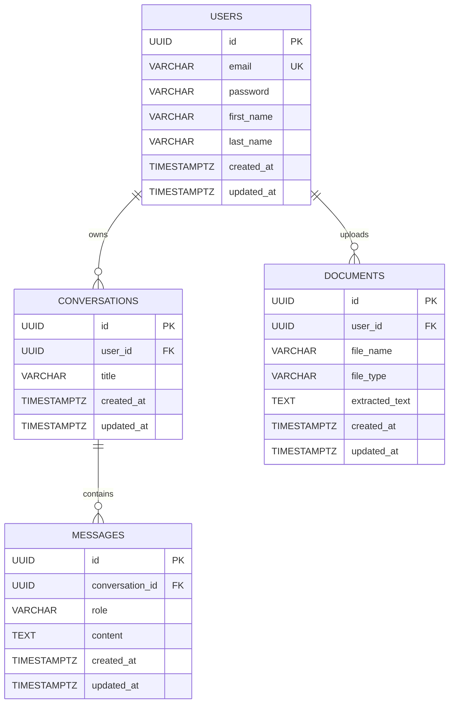

# Entity Relationship Diagram

The following ER diagram represents the database schema used by the AI Knowledge Assistant.

---

## Relationships

- A **User** can own multiple **Conversations**.
- A **Conversation** can contain multiple **Messages**.
- A **User** can upload multiple **Documents**.

---

## Cascade Delete Rules

- Deleting a **User** deletes all associated Conversations.
- Deleting a **Conversation** deletes all associated Messages.
- Deleting a **User** deletes all associated Documents.

---

## Constraints

- `users.email` is unique.
- `messages.role` accepts only:
  - USER
  - ASSISTANT

---

## Indexes

The following indexes are created to improve query performance:

| Index | Purpose |
|--------|---------|
| idx_conversations_user_updated_at | Fetch user conversations ordered by latest activity |
| idx_messages_conversation_created_at | Load conversation messages chronologically |
| idx_documents_user_created_at | Fetch recently uploaded documents |