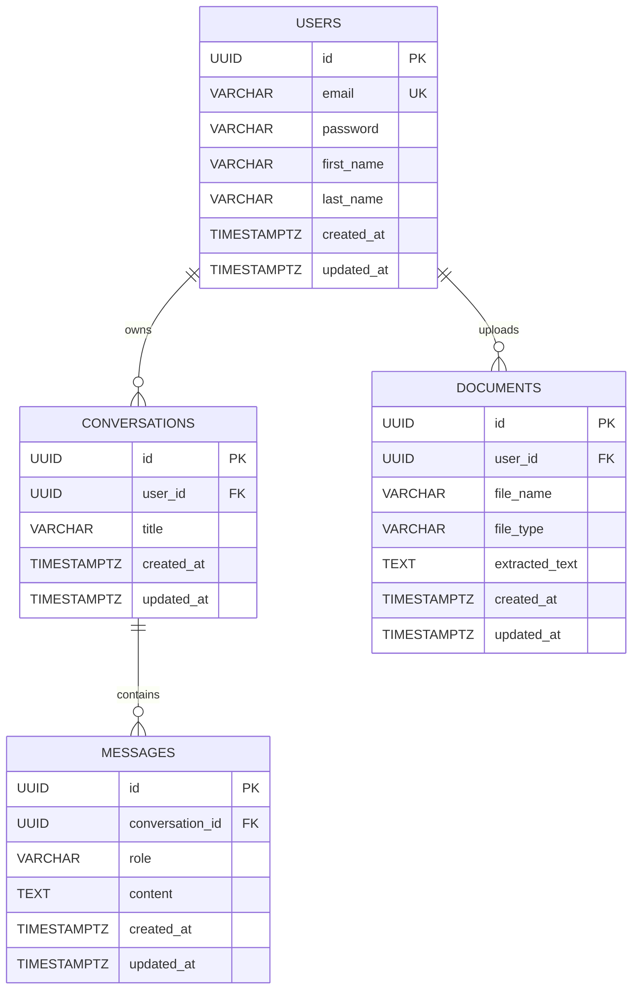

# Entity Relationship Diagram

## Relationships

- One user can own many conversations.
- One conversation can contain many messages.
- One user can upload many documents.
- Deleting a user removes their conversations and documents.
- Deleting a conversation removes its messages.

## Constraints

- `users.email` is unique.
- `messages.role` is restricted to `USER` or `ASSISTANT`.
- All primary keys use UUIDs.
- Foreign keys use cascading deletes.

## Indexes

- `idx_conversations_user_updated_at`
    - Optimizes fetching a user's conversations ordered by recent activity.

- `idx_messages_conversation_created_at`
    - Optimizes loading messages in chronological order for a conversation.

- `idx_documents_user_created_at`
    - Optimizes fetching a user's recently uploaded documents.